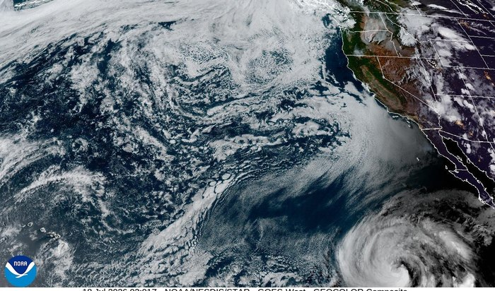
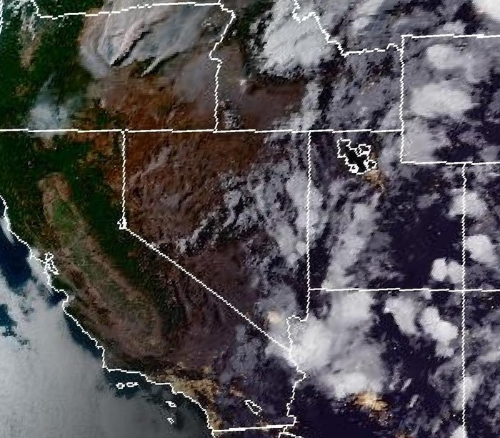
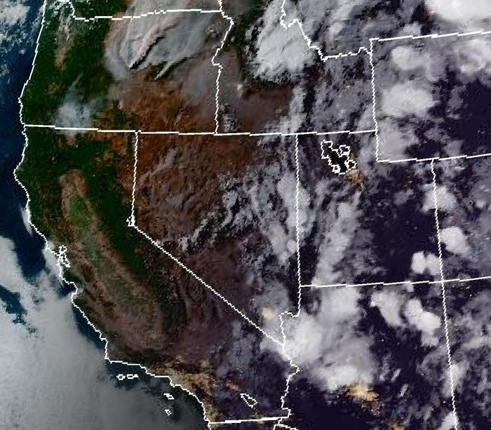
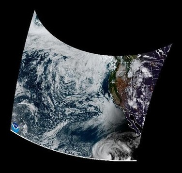
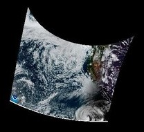

# Output projection gallery

Example renders of every `output_projection` value, all from the same live GOES-18
CONUS GEOCOLOR frame (so the differences below are purely the projection, not the
source data — the day/night terminator visible in some of these is real, not an
artifact). See the "Output projection" section of [README.md](README.md) for the full
config reference.

## `"native"` (default)

No reprojection — the satellite's own GEOS view, exactly as `cdn_jpg`/`satpy_raw`
produce it.



## `"platecarree"` — equirectangular

Framed by `source_crop_min_lon/min_lat/max_lon/max_lat` (chosen here to stay fully
inside the CONUS frame's actual coverage — a box that reaches past its edges, e.g.
too far east/south, comes back with black "no data" margins where the box falls
outside what the source frame actually captured). Simple (lon/lat map directly to
pixel rows/columns) but visibly stretches north-south distances at this latitude.

```toml
output_projection = "platecarree"
source_crop_min_lon = -124.0
source_crop_min_lat = 32.0
source_crop_max_lon = -108.0
source_crop_max_lat = 46.0
```



## `"lambertconformal"` — conformal conic

Same bounds as above. This is what NWS/NOAA's own CONUS maps use — standard
parallels default to 1/6 and 5/6 up the box's latitude range, giving negligible
shape distortion across a CONUS-sized area. At this scale it looks close to
`platecarree`; the difference grows with the box's latitude span (and matters much
more than it looks here once you're comparing distances/areas rather than just
eyeballing coastlines).

```toml
output_projection = "lambertconformal"
source_crop_min_lon = -124.0
source_crop_min_lat = 32.0
source_crop_max_lon = -108.0
source_crop_max_lat = 46.0
# output_projection_lcc_lat1 = 33.0  # optional, defaults to the 1/6 rule above
# output_projection_lcc_lat2 = 45.0
```



## `"orthographic"` — globe view

Centered on `output_projection_center_lon/_center_lat` (here, off the California
coast) — a view as seen from space. Black outside the visible hemisphere, which is
"space," not a bug; note the curved (barrel-distorted) edges of the CONUS content
itself, and the day/night terminator crossing the frame. The actual output canvas is
square and mostly black margin around the content (only CONUS was fetched, not a
real full-disk image) — cropped in tight here for legibility; `crop_to_screen`
(cover-crop) handles fitting the real output to your actual screen the same way it
does for `"native"`.

```toml
output_projection = "orthographic"
output_projection_center_lon = -115.0
output_projection_center_lat = 37.0
```



## `"lambertazimuthal"` — equal-area azimuthal

Same center point as `orthographic` above, same canvas size — but the canvas now
spans the *whole* globe (out to, not including, the antipode) instead of just the
visible hemisphere, so the same real CONUS content occupies a visibly smaller
fraction of the frame (cropped in tight here too, same as `orthographic` above).
Useful if you actually want to see more of the globe than `orthographic` can show
(it's capped at the visible hemisphere); less "photographic" looking as a result.

```toml
output_projection = "lambertazimuthal"
output_projection_center_lon = -115.0
output_projection_center_lat = 37.0
```



## Picking one

- Framing a specific region and want it to look geometrically "correct" (a normal
  regional map): **`lambertconformal`**.
- Want the simplest possible mapping (e.g. feeding the output into other lon/lat-grid
  tooling): **`platecarree`**.
- Want a wallpaper that looks like a real view of Earth from space: **`orthographic`**.
- Want to see as much of the globe as possible from one center point: **`lambertazimuthal`**.
- Don't care, or want NOAA's/satpy's imagery exactly as delivered: **`native`**.

All four non-native projections work identically for the default `cdn_jpg` source
(CONUS/Full Disk only) and `source_kind = "satpy_raw"` (any sector) — see
`reproject_frame` in `goes_wallpaper.py`.

## Known quality limitations

`reproject_frame` is pure nearest-neighbor resampling (`pyproj`/`numpy` only, no
`pyresample`/`satpy` dependency) — cheap and dependency-free, but visibly rougher
than a real resampling library in two ways:

* **Jagged valid-data edges.** Look closely at the `orthographic`/`lambertazimuthal`
  renders above — the boundary between real content and the black "no data" margin
  is stair-stepped, not a clean curve. There's no anti-aliasing at that boundary.
* **Overlays get warped, not redrawn.** `overlay_graticule`/`overlay_cities`/
  `overlay_geojson_files`/`overlay_shell_command` all draw onto the source image's
  native GEOS pixel grid *before* `reproject_frame` runs (see the fetch pipeline in
  `goes_wallpaper.py`), so their pixels get dragged through the same nearest-neighbor
  warp as everything else instead of being reprojected as geometry. Thin graticule/
  GeoJSON lines can break into dashed, patchy segments; city-marker circles can
  distort; text labels can shear — worst near the projection's edges, where the
  per-pixel distortion is largest. `lambertconformal`/`platecarree` over a
  CONUS-sized box are close enough to the source projection that this is barely
  visible; `orthographic`/`lambertazimuthal` show it the most.

Both are tracked as a follow-up in `NEXT_STEPS.md` rather than fixed here — cheapest
likely fix is supersampling (render at higher resolution, downsample with
antialiasing after reprojecting); the more thorough fix is reprojecting overlay
*geometry* directly into the destination projection instead of warping already-drawn
pixels, which would also need `pyresample`/similar for the base-image resampling to
be worth doing at the same time.
