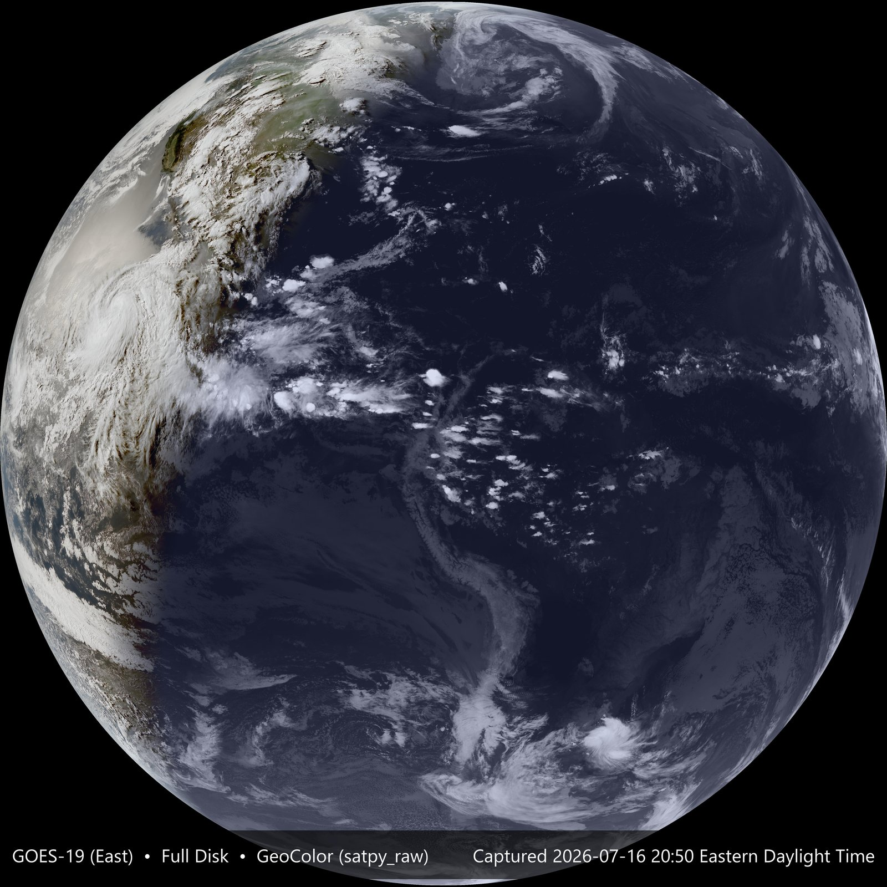

# GOES Desktop Wallpaper Updater

Downloads the most recent image from a GOES weather satellite (NOAA STAR's public
CDN) and sets it as your desktop wallpaper — on Windows, KDE Plasma, or macOS —
cropped exactly to your screen, with an optional info bar showing
satellite/sector/product and capture time.


## Contents

[Install](#install) · [Configuration](#configuration) ·
[Multi-source combos](#multi-source-combos) ·
[Georeferenced overlays](#georeferenced-overlays) (full schema: [OVERLAYS.md](OVERLAYS.md)) ·
[Output projection](#output-projection) (gallery: [PROJECTIONS.md](PROJECTIONS.md)) ·
[Custom raw-data source (satpy_raw)](#custom-raw-data-source-satpy_raw) ·
[Power/network-aware fallbacks](#powernetwork-aware-fallbacks) ·
[Cross-platform](#cross-platform) · [Freshness sync](#freshness-sync) ·
[Running periodically](#running-periodically) (full guide: [RUNNING.md](RUNNING.md)) ·
[Source image caveats](#source-image-caveats) ·
[Notes and known limitations](#notes-and-known-limitations) · [Tests](#tests) ·
[Contributing](#contributing) · [Changelog](#changelog) · [License](#license)

## Install

Requires Python 3.11+ and one of:

* **Windows**
* **KDE Plasma** on Linux (5.24+ for `plasma-apply-wallpaperimage`; older Plasma 5
  falls back to D-Bus scripting). Other Linux desktops aren't implemented yet —
  see [CONTRIBUTING.md](CONTRIBUTING.md) to add one.
* **macOS**, via `pyobjc` (see [Cross-platform](#cross-platform) for verification
  status)

### From source

```powershell
uv sync
uv run python goes_wallpaper.py
```

`uv sync` creates `.venv/` and installs dependencies, pulling in the right
OS-specific extras automatically (`comtypes`/`winrt-*` on Windows,
`pyobjc-framework-Cocoa` on macOS; the KDE backend instead shells out to
`qdbus6`/`qdbus`, `plasma-apply-wallpaperimage`, `upower`, `nmcli`, which you
already have on a Plasma desktop). The command above does one full run
immediately — fetches the latest image, crops it to your screen, and sets it as
your wallpaper. Check your data dir for the result (`wallpaper.jpg`,
`wallpaper.json`, `log.txt`): `%LOCALAPPDATA%\GOES-Wallpaper\` on Windows,
`~/.local/share/goes-wallpaper/` on Linux, `~/Library/Application Support/
GOES-Wallpaper/` on macOS.

### Without cloning

`uv` installs straight from GitHub — no manual download, no repo checkout:

```powershell
uv tool install git+https://github.com/John-Schreiber/GOES-Wallpaper
goes-wallpaper --config path\to\config.toml
```

(Same command on every OS/shell. Pin a specific release instead of tracking
`main` by appending a tag, e.g. `...GOES-Wallpaper@v2.2.0`.) This installs two
entry points: `goes-wallpaper` (console) and `goes-wallpaperw` (no console
popup — for a Task Scheduler/shortcut-style launch). An installed copy has no
`config.toml` next to it, unlike a source checkout — pass `--config`
explicitly (see [config.example.toml](config.example.toml) for a starting
point), or it runs on built-in defaults.

## Configuration

Behavior is driven by [config.toml](config.toml), read by default from next to the
script (override with `--config path\to\other.toml`). Every field has an inline
comment; the highlights:

* **Source image** — `satellite` (`GOES19` east / `GOES18` west), `sector`
  (`CONUS`, `FD` full disk, `M1`/`M2` mesoscale), `product` (e.g. `GEOCOLOR`),
  `resolution`. NOAA serves discrete sizes per sector, not an arbitrary resize.
  Default is `5000x3000`, enough to cover a 4K monitor without upsampling —
  bump higher if you crop aggressively via `source_crop_*`/combos.
* **`source_kind`** — `"cdn_jpg"` (default, the above) or `"satpy_raw"`
  (composite your own image from raw satellite data instead — heavier, opt-in).
  See [Custom raw-data source](#custom-raw-data-source-satpy_raw) below.
* **Screen handling** — `crop_to_screen` does a cover-crop so the image exactly
  fills your screen; `crop_anchor` biases where that crop is taken from;
  `span_all_monitors` crops to the full virtual desktop instead of just the
  primary monitor (pair with `wallpaper_style = "span"`). `source_crop_left/top/
  right/bottom` (fractions of the source frame) crop *before* that, to frame a
  region of interest or cut off NOAA's logo watermark — see
  [Source image caveats](#source-image-caveats). `source_crop_min_lon/min_lat/
  max_lon/max_lat` do the same crop via a lon/lat bounding box instead — see
  [OVERLAYS.md](OVERLAYS.md) for the calibration this relies on.
* **Freshness sync** — learns when NOAA actually publishes each interval's new
  frame and schedules around that. See [Freshness sync](#freshness-sync) below.
* **Info block / EXIF** — an overlay bar with satellite/sector/product and
  capture time; the same details are also baked into the JPEG's EXIF tags.
  `avoid_taskbar` (default on) keeps the bar clear of the taskbar/dock.
* Any field can also be set via CLI flag, e.g. `--sector FD --no-info-block`.
  Run `uv run python goes_wallpaper.py --help` for the full list.
* **Multi-source combos** — `combo_mode` (`"single"` / `"rotate"` /
  `"per_monitor"`) plus a list of named `[[combos]]`. See
  [Multi-source combos](#multi-source-combos) below.
* **Georeferenced overlays** — a lat/lon grid, city markers, GeoJSON files, and a
  live shell-command GeoJSON source, configured separately in `overlays.toml`.
  See [OVERLAYS.md](OVERLAYS.md).
* **`output_projection`** — reproject the frame into `platecarree`/
  `lambertconformal`/`orthographic`/`lambertazimuthal` instead of the satellite's
  native view. See [Output projection](#output-projection) below.

## Multi-source combos

Beyond the single top-level source, `config.toml` can define named combos and a
`combo_mode` for how to use them:

* **`"rotate"`** cycles through the combo list one per cycle — each `--loop`
  cycle (or scheduled run) shows a different source/crop, remembering where it
  left off in `state.json`. Good for variety on a single monitor, e.g.
  alternating GEOCOLOR/Clean IR or GOES East/West.
* **`"per_monitor"`** assigns one combo per physical monitor via `monitor`
  (0-based) and applies each independently — genuinely different images per
  screen, not one image spanned/tiled across all of them. Every combo needs a
  `monitor` in this mode; an unassigned monitor is left untouched. Each combo
  triggers its own download, so cycle time scales with how many you assign.

An unset combo field falls back to the top-level `satellite`/`sector`/`product`/
`resolution`; the crop fields (`crop_left/top/right/bottom`) always apply,
defaulting to no crop. `crop_min_lon/min_lat/max_lon/max_lat` behave like the
source-selection fields instead — unset falls back to the top-level
`source_crop_*` rather than always applying. See the commented examples in
[config.toml](config.toml).

Note: the `monitor` index is the platform backend's own enumeration order, which
isn't guaranteed to match the numbers shown in your OS's display settings — swap
indices if wallpapers land on the wrong screen.

## Georeferenced overlays

A lat/lon grid, labeled city markers, static GeoJSON files, and a live
shell-command GeoJSON source can all be drawn accurately onto the image — real
georeferencing, not eyeballed. Configured in a separate file, `overlays.toml`,
not `config.toml`. See [OVERLAYS.md](OVERLAYS.md) for the full schema, styling
rules, and the CONUS/Full Disk-only calibration caveat (any sector is supported
with `source_kind = "satpy_raw"`, below).

## Output projection

`output_projection` reprojects the rendered frame into a different map
projection instead of the satellite's native view. `"native"` (default) means no
reprojection.

* **`"platecarree"`** (equirectangular) and **`"lambertconformal"`** (conformal
  conic — the standard for a mid-latitude regional map, negligible distortion
  over a CONUS-sized box) are framed by `source_crop_min_lon/min_lat/max_lon/
  max_lat`, which become the output's extent.
* **`"orthographic"`** (a globe view from space) and **`"lambertazimuthal"`**
  (equal-area, shows more of the globe than orthographic) are centered on
  `output_projection_center_lon`/`_center_lat` (default: the source's own
  sub-satellite point and the equator).

Works for both `cdn_jpg` (CONUS/Full Disk) and `satpy_raw` (any sector). Not
combo-overridable — every combo shares one `output_projection`. Falls back to
native, logged, if there's no calibration for the resolved satellite/sector.

Two known quality caveats, both nearest-neighbor resampling artifacts: no
anti-aliasing at the valid-data/black boundary in `orthographic`/
`lambertazimuthal`, and overlays get warped along with the base image instead of
redrawn as geometry (worst near the projection's edges). See
[PROJECTIONS.md](PROJECTIONS.md) for example renders and the full writeup.

## Custom raw-data source (satpy_raw)

`source_kind = "satpy_raw"` fetches raw ABI L1b radiance bands directly from the
public `noaa-goes16`/`noaa-goes18`/`noaa-goes19` S3 buckets (anonymous access)
and composites a GeoColor-style image locally with
[satpy](https://satpy.readthedocs.io/), instead of NOAA STAR's pre-rendered JPG.
No baked-in state lines, logo, or fake city lights — and real per-frame
georeferencing, so overlays and output projection work on Full Disk and
Mesoscale too, not just CONUS. See
[CUSTOM_IMAGERY_PLAN.md](CUSTOM_IMAGERY_PLAN.md) for the design rationale.

Install the extra it needs (heavy geospatial libraries, not part of the default
install):

```powershell
uv sync --extra satpy-raw
# or: pip install goes-wallpaper[satpy-raw]
```

Then set, top-level or per-combo:

```toml
source_kind = "satpy_raw"
satellite = "GOES18"
sector = "CONUS"   # CONUS, FD, M1, or M2
```

`product`, `resolution`, and `metered_resolution` are ignored for this
`source_kind` — satpy always builds one fixed-band composite.

**Read before enabling on a `--loop` interval.** This is heavier than
`cdn_jpg`'s single small JPG: every cycle downloads four raw bands and
composites them fresh, with no cross-cycle caching. A live CONUS fetch measured
~98MB across the four bands; Full Disk is considerably more (one band alone was
~405MB). Compositing itself takes roughly 20-45s. Test with `--render-to` (see
[Tests](#tests)) before committing to a schedule, especially for Full Disk or on
a metered connection.

**Night side** isn't GEOCOLOR's synthetic city lights (those come from a static
VIIRS composite, not real-time data) — instead it's a day/night blend built from
true color by day and Band 13 brightness temperature by night, following the
real solar terminator.



**Status**: opt-in alongside `cdn_jpg`, not a replacement — no automatic
fallback if a raw fetch fails. Verified end to end against live GOES-18/19 data
for both CONUS and Full Disk.

## Power/network-aware fallbacks

`skip_on_battery` (skip the whole cycle on battery power) and
`metered_resolution` (fetch a smaller size on a cost-metered connection) are
both off by default. Detection goes through the platform backend and degrades
to "unknown" on hardware/platforms that can't detect it — unknown is always
treated as "not constrained," so enabling these never risks skipping or
downgrading on a guess.

## Cross-platform

OS-specific operations (applying the wallpaper, monitor detection, taskbar/dock
avoidance, battery/network detection) live behind
`platform_base.WallpaperPlatform`, with one implementation per backend:
`platform_windows.py`, `platform_linux_kde.py`, `platform_macos.py`,
`platform_render.py`. `goes_wallpaper.py` itself has no OS-specific code —
`get_platform()` picks a backend from `sys.platform` (Windows, macOS) or
`XDG_CURRENT_DESKTOP`/`XDG_SESSION_DESKTOP` containing `"kde"` (Linux), raising
`NotImplementedError` for any other Linux desktop. Force one explicitly with
`platform = "windows"`/`"kde"`/`"macos"`/`"render"` in config.toml.

* **Windows** — full support via the `IDesktopWallpaper` COM interface, WMI, and
  WinRT. Every method confirmed on real hardware.
* **KDE Plasma** — talks to Plasma's own D-Bus scripting interface (works under
  both X11 and Wayland), preferring the `plasma-apply-wallpaperimage` CLI when
  present. No `"span"` equivalent (degrades to `"fill"`, logged). The default
  single-screen path is confirmed on real hardware; `per_monitor` mode and
  battery/network parsing are unit-tested only — see `NEXT_STEPS.md` item 11.
  Needs a live desktop session (D-Bus) — see
  [Running periodically](#running-periodically).
* **macOS** — via `pyobjc`'s `NSWorkspace`/`NSScreen`. No `"tile"`/`"span"`
  equivalent (degrades to `"fill"`, logged). Same verification split as KDE: the
  default single-screen path is confirmed on a real MacBook; multi-monitor and
  battery detection are unit-tested only — see `NEXT_STEPS.md` item 22.
* **Render-only** (`platform = "render"`) — for headless boxes with no desktop
  shell at all (a server, a container, CI). Never applies a wallpaper; pairs
  with `render_to`/`--render-to`. Screen size defaults to 1920×1080, override
  with `screen_width`/`screen_height`. Never chosen by `"auto"` — opt in
  explicitly.

Want to add GNOME or another desktop environment? See
[CONTRIBUTING.md](CONTRIBUTING.md).

## Freshness sync

NOAA doesn't publish a new frame right on the clock boundary — there's a
processing/CDN lag after each scan (observed ~40-55s past the boundary on
CONUS/GEOCOLOR, varies by satellite/product). Three settings, layered:

* **`sync_to_capture_time`** (on by default) learns the lag from each frame's
  actual capture time and schedules `--loop`'s next wake-up shortly after,
  instead of guessing at the raw boundary. Nothing to learn from on the first
  cycle — that one falls back to plain clock-boundary alignment. The learned
  offset persists per-source in `state.json`, surviving restarts.
* **`wait_for_fresh_capture`** (on by default) is the in-cycle backstop: if a
  download comes back with the same capture time as last cycle, it retries a
  few times before giving up rather than applying stale content.
* **`--wait-for-sync`** (off by default) is for single-shot/Task Scheduler use —
  see [RUNNING.md](RUNNING.md).

## Running periodically

Three options — the built-in `--loop` mode, Windows Task Scheduler, or a Linux
systemd `--user` timer — with setup instructions and tradeoffs for each. See
[RUNNING.md](RUNNING.md).

## Source image caveats

These apply to the default `source_kind = "cdn_jpg"`, which fetches NOAA STAR's
already-rendered JPG. `source_kind = "satpy_raw"` (above) has none of these,
since it composites the image from raw bands itself.

NOAA STAR's CDN bakes some things into the image pixels themselves, which this
script can't strip out:

* **State/country border lines are on every product**, not just GEOCOLOR, drawn
  across the whole frame — no crop setting can remove them.
* **"Fake" city lights are GEOCOLOR-specific.** GEOCOLOR blends a static VIIRS
  nighttime-lights composite into the night side; it's not real-time data.
  Raw bands like `13` (Clean IR) don't do this, at the cost of GEOCOLOR's
  true-color daytime look.
* **NOAA's logo watermark** sits in the bottom-left corner of every frame. Use
  `source_crop_left` (e.g. `0.10`) to trim it before the screen-fit crop.

## Notes and known limitations

* **Screen size detection normally needs an interactive session**, falling back
  to `1024x768` without one (e.g. a scheduled task running whether or not a user
  is logged on). `wmi_screen_size_fallback` (default on, Windows) recovers the
  real resolution via WMI in that case. If that's not enough, set
  `screen_width`/`screen_height` explicitly — the script logs a warning if it
  ends up on the `1024x768` fallback.
* **`span_all_monitors`** requires Windows 8+ for the `"span"` wallpaper style
  to actually stretch one image across all displays; see
  [Multi-source combos](#multi-source-combos) above for genuinely different
  images per monitor instead.

## Tests

```powershell
uv run pytest
```

Covers config loading/validation, source resolution, crop math,
freshness-sync/wait-for-sync scheduling, and CONUS georeferencing (regression
tests against real city landmarks). No real network access or OS APIs required —
platform-specific behavior is tested through a fake `WallpaperPlatform` stub.
`tests/test_source_satpy.py` covers `satpy_raw`'s pure band/scan-selection logic
without needing the `satpy-raw` extra installed; real S3/satpy exercise is
manual-only.

To inspect a real render without touching your actual wallpaper, use
`--render-to`:

```powershell
uv run python goes_wallpaper.py --render-to test_render.jpg
```

This runs one full fetch/crop/overlay/info-block cycle and saves the result to
the given path, skipping `apply_wallpaper()` — useful for checking a new
`source_kind`, overlay, or crop setting before enabling it for real.

## Contributing

See [CONTRIBUTING.md](CONTRIBUTING.md). Windows, KDE Plasma, and macOS all have
working backends now; a backend for any other OS/desktop environment is a
welcome contribution, and other changes are welcome too.

## Changelog

See [CHANGELOG.md](CHANGELOG.md).

## License

GNU General Public License v3.0-or-later — see [LICENSE](LICENSE). This project
began as a clone of an Apache-2.0-licensed original and has since been
substantially rewritten; see [ATTRIBUTION.md](ATTRIBUTION.md) for the full
origin/credits and the preserved original license notice.
